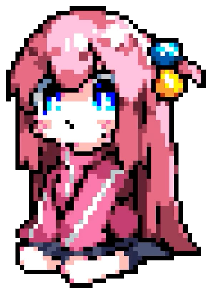

## 👋 Hi, I'm FOPA — aka `Lesha`

**Vibe coder, writer, content creator, and professional chat instigator.**

I build agent tools, creative workflows, and strange little systems
where AI gets access to real devices.

**Vibe-coded software. Human-written words.**

```
🤖 Vibe coding • AI agents • automation
⌨️ Claude Code • custom skills • MCP
🐍 Python • Telegram bots • Supabase
🧰 Tools I've worked with: Claude Code • Playwright • Telethon
```

[](https://github.com/aleks-fw/CodeCheck-MCP)
[](https://t.me/myportfoIia)

<br clear="right">

## 🌤 Outside the terminal

I'm into gameplay-first single-player and indie games, mechanical keyboards, and the pure joy of typing.

🇷🇺 Native Russian speaker. English when necessary.

<div align="center">
  
  <br>
  <a href="https://t.me/Lcrealor"></a>
  <a href="https://x.com/creatorulep"></a>
</div>
