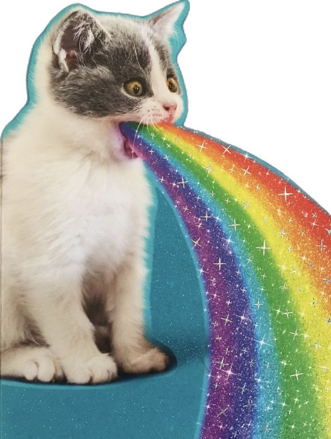
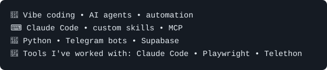

### 👋 Hi, I'm FOPA — aka `Lesha`

**Vibe coder, writer, content creator, and professional chat instigator.**

I build agent tools, creative workflows, and strange little systems
where AI gets access to real devices.

**Vibe-coded software. Human-written words.**

 

### 🌤 Outside the terminal

I'm into gameplay-first single-player and indie games, mechanical keyboards, and the pure joy of typing.

🇷🇺 Native Russian speaker. English when necessary.

  
   
  
  

